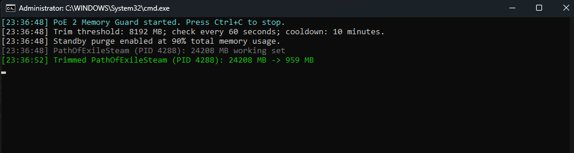

# PoE 2 Memory Guard (Windows 11)



*Working-set trim in action: 24,208 MB -> 959 MB*

PoE 2 Memory Guard monitors Path of Exile's memory usage and trims its working set when it reaches a configured threshold. It can also use Microsoft Sysinternals RAMMap to purge the Windows standby list when total system memory usage is high.

See [CHANGELOG.md](CHANGELOG.md) for release history.

> This is a mitigation, not a fix for the game's underlying memory leak. The game may briefly stutter after a trim while Windows reloads required data into RAM.

### How it works

- Checks for processes whose names begin with `PathOfExile` every 15 seconds.
- At 8 GB of PoE working-set usage, PowerShell calls the Windows `EmptyWorkingSet` API for the PoE process only.
- RAMMap mode is disabled by default, so normal operation affects only the PoE process.
- When explicitly enabled, RAMMap purges the system-wide standby list at 90% total memory usage.
- Each operation has a 2-minute cooldown. PoE trimming and standby-list purging use independent cooldowns.
- On launch, the guard checks the latest GitHub release and updates itself when a newer ZIP is available.
- The guard can be started before the game and will wait until a matching process appears.

### Quick start

1. Right-click `Start-Memory-Guard.cmd` and select **Run as administrator**.
2. Leave the window open while playing. You may start the game before or after the guard.
3. Press `Ctrl+C` or close the window to stop it.

The default `config.json` uses only `EmptyWorkingSet` on the PoE process. To enable the optional system-wide standby-list purge, change `EnableRAMMap` to `true`. On the next launch, the launcher downloads RAMMap directly from Microsoft Sysinternals, verifies its Microsoft digital signature, and stores it under `Tools\RAMMap`.

```json
{
  "EnableAutoUpdate": true,
  "EnableRAMMap": false,
  "CheckEverySeconds": 15,
  "TrimWhenWorkingSetMB": 8192,
  "TrimCooldownMinutes": 2,
  "PurgeStandbyWhenMemoryUsedPercent": 90
}
```

### Custom settings

Open PowerShell in this folder and run, for example:

```powershell
.\PoE2-Memory-Guard.ps1 -TrimWhenWorkingSetMB 12000 -CheckEverySeconds 30 -TrimCooldownMinutes 15
```

Perform one immediate trim for testing:

```powershell
.\PoE2-Memory-Guard.ps1 -TrimImmediately -Once
```

Use a different RAMMap location or system-memory threshold:

```powershell
.\PoE2-Memory-Guard.ps1 -StandbyToolPath "C:\Tools\RAMMap64.exe" -PurgeStandbyWhenMemoryUsedPercent 90
```

### Notes

- Trimming at 8 GB affects only the PoE process, not other applications.
- Standby-list purging affects the Windows system cache; it does not trim every application's working set.
- Auto-update downloads the latest release ZIP from GitHub and preserves your existing `config.json` values.
- It is normal for PoE's working set to increase again after trimming.
- Restarting the game remains a more complete way to reclaim memory retained by a leak.
